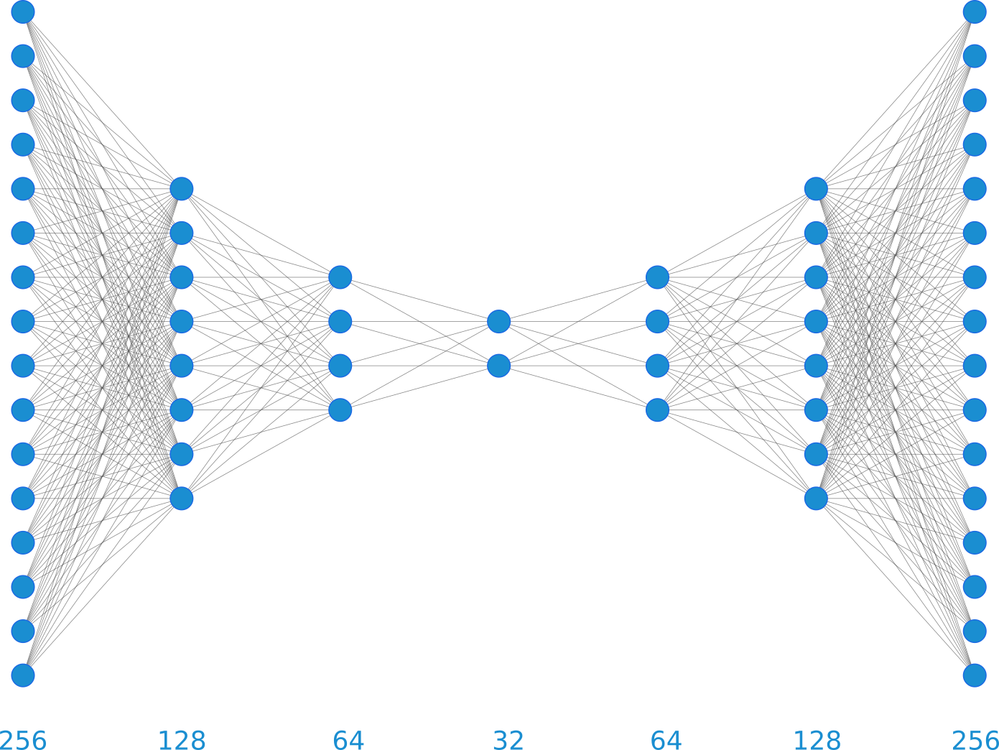

==============
sc-autoencoder
==============

.. image:: https://github.com/mlf-core/sc-autoencoder/workflows/Train%20sc-autoencoder%20using%20CPU/badge.svg
        :target: https://github.com/mlf-core/sc-autoencoder/workflows/Train%20sc-autoencoder%20using%20CPU/badge.svg
        :alt: Github Workflow CPU Training sc-autoencoder Status

.. image:: https://github.com/mlf-core/sc-autoencoder/workflows/Publish%20Container%20to%20Docker%20Packages/badge.svg
        :target: https://github.com/mlf-core/sc-autoencoder/workflows/Publish%20Container%20to%20Docker%20Packages/badge.svg
        :alt: Publish Container to Docker Packages

.. image:: https://github.com/mlf-core/sc-autoencoder/workflows/mlf-core%20lint/badge.svg
        :target: https://github.com/mlf-core/sc-autoencoder/workflows/mlf-core%20lint/badge.svg
        :alt: mlf-core lint

.. image:: https://readthedocs.org/projects/sc-autoencoder/badge/?version=latest
        :target: https://sc-autoencoder.readthedocs.io/en/latest/?badge=latest
        :alt: Documentation Status

An autoencoder for single cell data.

* Free software: MIT
* Documentation: https://sc-autoencoder.readthedocs.io.

Features
--------

* Fully reproducible mlf-core Tensorflow model
* MLF-CORE TODO: Write features here

Credits
-------

This package was created with `mlf-core`_ using Cookiecutter_.

.. _mlf-core: https://mlf-core.readthedocs.io/en/latest/
.. _Cookiecutter: https://github.com/audreyr/cookiecutter
